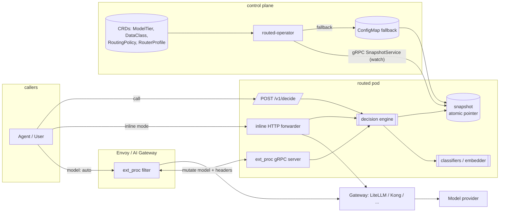

# Architecture

> Draft. Updated as phases land.

routeD is a decision layer between callers and an LLM gateway. One binary
(`routed`) serves two ingress modes and a decision API; an operator compiles
CRDs into snapshots; `routedctl` reuses the same compiler and engine offline.

## Ingress modes and the operator / snapshot flow



## Snapshot distribution (ADR-0014)

Every operator replica watches the four CRDs, relists on any change and runs
`routed_policy::compile` once over the full set. Compilation is pure and
deterministic, so replicas independently produce byte-identical snapshots and
serve them to routers over `SnapshotService.Watch` (gRPC, payload = canonical
Snapshot JSON) with no coordination. Leader election (`Lease`) gates only the
write paths: `status.conditions` / `compiledHash` on the CRs and the fallback
`ConfigMap` carrying the same compiled JSON, which the chart mounts into the
router as a file. Router source precedence: `--snapshot-addr` (gRPC), then
`--snapshot-path` (compiled file), then `--resources` (local compile,
standalone use). The router never talks to the Kubernetes API.

## Decision pipeline

```
request
  -> extract context (tenant, agent, headers -> hints, requested model, tools, token estimate)
  -> select RoutingPolicy (match + priority)
  -> not a routed alias?            -> PASS_THROUGH
  -> classifiers in parallel (per-classifier timeouts; timeout => conservative findings)
  -> dataClass = max(explicit header, inferred)
  -> candidate set from policy.candidates
  -> hard constraints, in order, each recording eliminations:
       1 denyIfRiskScoreAbove         -> BLOCK
       2 DataClass constraints (jurisdiction, cloudAct, operatorControl, allowedDataClasses)
       3 capabilities, context window
       4 tier.security.maxRiskScore
       5 maxCostPerRequest
  -> empty?  fallbackDecision if it satisfies the DataClass, else BLOCK
  -> score survivors (quality floor, weighted cost/quality/latency, learned router)
  -> select, compute parameters (reasoning budget, max_tokens)
  -> Decision + explanation (span, header, metrics)
```

## Crates

See `CLAUDE.md` for the layout map and `docs/adr/0005-workspace-layout-and-containerized-toolchain.md`
for the seam rules. The engine (`routed-decision`) is pure and deterministic;
everything with I/O lives in `routed-router` and the ingress crates.
